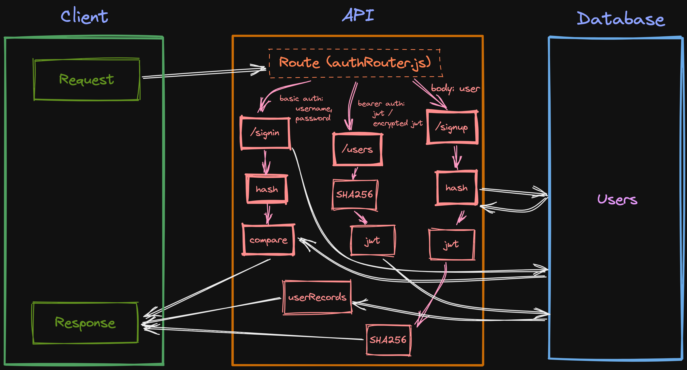

# Lab - Class 07

## Project: Bearer Auth

### Author: Julian Barker

### Problem Domain  

This repo is an API server that has routes for signup, sign-in, and a protected users route. It uses basic and bearer auth and started as a non-functional project with many errors that needed to be debugged. It also uses an additional layer of SHA256 encryption on top of the jwt.

### Links and Resources

- [deployment](https://four01-bearer-auth.onrender.com)

### Setup

#### `.env` requirements (where applicable)

- `PORT` - 3001
- `DATABASE_URL` - postgres://localhost:5432/\<database-name\>?sslmode=disable

#### How to initialize/run your application (where applicable)

- `npm start` (alias for `node index.js`)

#### Features / Routes

- GET : `/` - return "We're live!!!"
- POST : `/signup` - provide username and password in the body, and receive encryptede jwt token as a response
- POST : `/signin` - provide username and password as basic auth
- GET : `/users` - provide encrypted jwt token and receive list of user records as a response

#### Tests

- test suite was provided as starter code
- run tests with `npm test`

#### UML

### Attributions
